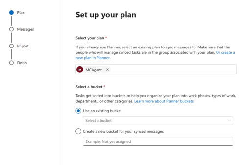
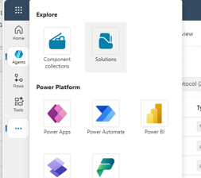

# Message Center Triage Agent

The Message Center Triage Agent helps automate the review and categorization of Microsoft 365 Message Center posts. The agent analyzes updates, determines impact, assigns ownership, and moves tasks into the appropriate Planner bucket for follow-up.

---

# Prerequisites

Before deploying the solution, ensure the following requirements are met:

- Power Platform Environment with Dataverse
- Copilot Studio Credits or Pay-As-You-Go configured
  - This is an autonomous agent and consumes generative AI capacity
- Microsoft 365 Message Center synchronized to Planner

---

# Configure the Planner Plan

Create a Planner plan with the following buckets:

- Informational
- Low
- Medium
- High
- Critical

> **Important:** Record the Planner Group Name and Plan Name. These values are required later when configuring the agent.



Enable Message Center synchronization to Planner using the Microsoft 365 admin configuration.

**Reference**

https://learn.microsoft.com/en-us/planner/track-message-center-tasks-planner#turn-on-planner-syncing

### Recommendations

- Select the **To-do** bucket during setup.
- If configuring synchronization for the first time, use **7 days** instead of **28 days** to reduce initial synchronization time.


---

# Import the Solution

1. Navigate to **copilotstudio.microsoft.com**
2. Select the target Power Platform environment.
3. From the left navigation menu, select **Solutions**.
4. Import the supplied **MessageCenterTriage.zip** solution.



Images/mc%20zip%20file.png

---

# Configure Workload Assignments

Open the included **WorkloadAssignments.xlsx** file.

Update the Product Owner assignments and save the file.

---

# Import Workload Assignments into Dataverse

Navigate to:

```
make.powerapps.com
```

Open:

```
Tables → MCTeamAssignments
```

Images/dataverse-import-1.png

Select:

```
Import → Import Data from Excel
```

Images/dataverseimportexcel.png

Upload the updated workload assignment spreadsheet.

Images/dataverse-import-excel2.png

Verify that the following mappings are present:

| Spreadsheet Column | Dataverse Column |
|-------------------|------------------|
| Owner | crxd_owner |
| Product | crxd_product |

Complete the import.

---

# Configure the Agent

Open **Copilot Studio** and select the **Message Center Triage Agent**.

Navigate to:

```
Tools
```

---

## MessageCenterPlanner Tool

Update the tool with:

- Microsoft 365 Group Name
- Planner Plan Name

---

## GetPlannerBuckets Tool

Update:

- Group Name
- Plan Name

---

## Get Plan Details Tool

Populate the Planner Plan ID.

The Plan ID can be obtained by opening the Planner board and copying the ID from the URL.

Images/Planner%20Details.png

---

## ListWorkloadAssignments Tool

Verify the configuration:

| Property | Value |
|-----------|--------|
| Environment | Current |
| Table | MCTeamAssignments |

Images/ListWorkloadAssignments.png

---

# Save and Publish

After all configuration steps are completed:

1. Save the agent
2. Publish the agent

---

# Optional: Microsoft Release Communications MCP

The solution includes an optional Microsoft Release Communications MCP connection.

This component is not required for the core triage functionality and may be removed if desired.

**Reference**

https://learn.microsoft.com/en-us/microsoft-365/admin/manage/mrc-mcp?view=o365-worldwide

---

# Testing the Agent

Once configuration is complete, test the agent with prompts such as:

```text
Help me triage MC1309733
```

```text
Provide a table of all Workload Assignments
```

```text
Tell me about roadmap ID 499660
```

The agent should:

- Retrieve the Message Center post
- Determine impact
- Identify workload owner
- Create or update Planner tasks
- Place work into the appropriate bucket

---

# Troubleshooting

### Workload Assignment Not Found

Verify:

- MCTeamAssignments records have been imported
- Product names match workload names appearing in Message Center posts
- Owner field contains valid values

### Planner Tasks Not Created

Verify:

- Planner Sync is enabled
- Planner Plan Name is correct
- Planner Group Name is correct
- Planner Plan ID is correct

### Planner Buckets Not Found

Verify that all required buckets exist:

- Informational
- Low
- Medium
- High
- Critical

---

# Resources

- https://learn.microsoft.com/en-us/planner/track-message-center-tasks-planner
- https://learn.microsoft.com/en-us/microsoft-365/admin/manage/mrc-mcp?view=o365-worldwide

---

# Repository Structure

```text
MessageCenterTriage
│
├── README.md
├── MessageCenterTriage.zip
├── WorkloadAssignments.xlsx
│
└── Images
    ├── ListWorkloadAssignments.png
    ├── Planner-buckets.png
    ├── Planner Details.png
    ├── solution-import.png
    ├── mc zip file.png
    ├── dataverse-import-1.png
    ├── dataverseimportexcel.png
    └── dataverse-import-excel2.png
```
